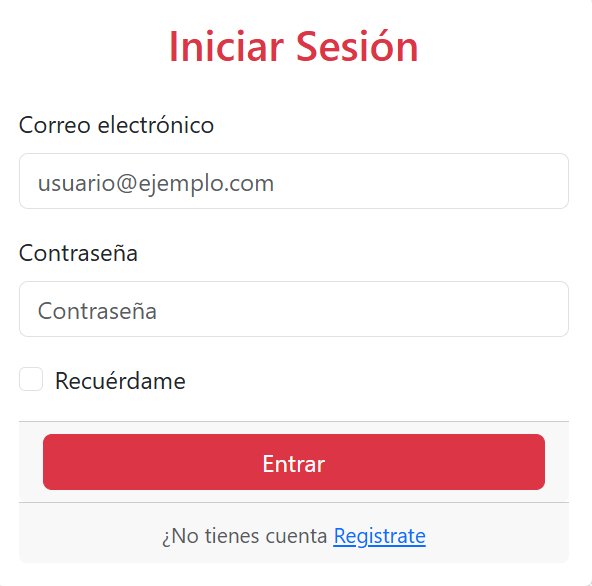
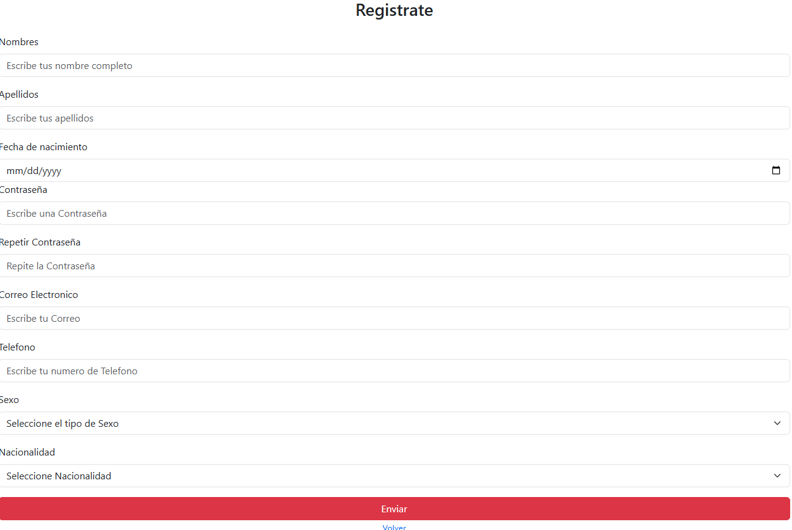

Formulario de Inicio de Sesión
Este proyecto es una plantilla básica de formulario de inicio de sesión construida con HTML5, Bootstrap 5.3.6 y SweetAlert2. Se trata de una interfaz simple y responsiva ideal para integrarse en aplicaciones web que requieren autenticación.

🚀 Características
✅ Diseño responsivo usando Bootstrap 5

✅ Formulario de inicio de sesión con campos de correo electrónico y contraseña

✅ Checkbox de "Recuérdame"

✅ Enlaces para recuperación de contraseña y registro

✅ Estilo moderno con tarjetas (card) y botones

✅ Preparado para integrar lógica de validación o conexión con backend

📁 Estructura del proyecto
bash
Copiar
Editar
/tu-proyecto
│
├── index.html                 # Página principal con el formulario
├── /html
│   ├── Recuperar.html         # Página de recuperación de contraseña (no incluida)
│   └── login.html             # Página de registro (no incluida)
├── /Js
│   └── aprender.js            # Script JavaScript personalizado (vacío o personalizado)
└── README.md                  # Este archivo

📦 Tecnologías utilizadas
HTML5

Bootstrap 5.3.6

SweetAlert2

📷 Captura de pantalla

🛠 Cómo usar
Clona el repositorio:

bash
Copiar
Editar
git clone https://github.com/alesx777/login-booststrapp.git
Abre el archivo index.html en tu navegador web.

Asegúrate de tener conexión a Internet para que funcionen los CDN de Bootstrap y SweetAlert.

📝 Notas
Este proyecto no incluye validación real ni conexión con bases de datos.

